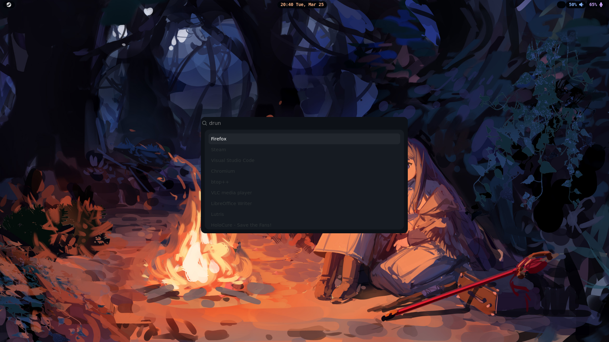

# my dotfiles repo - nixos

i use stow instead of home-manager for dotfiles

# Screenshots

| -                | -        | Screenshot                                               |
| ---------------- | -------- | -------------------------------------------------------- |
| window manager   | hyprland |  |
| launcher         | wofi     |        |
| file manager     | yazi     |        |
| resource monitor | btop     |        |
