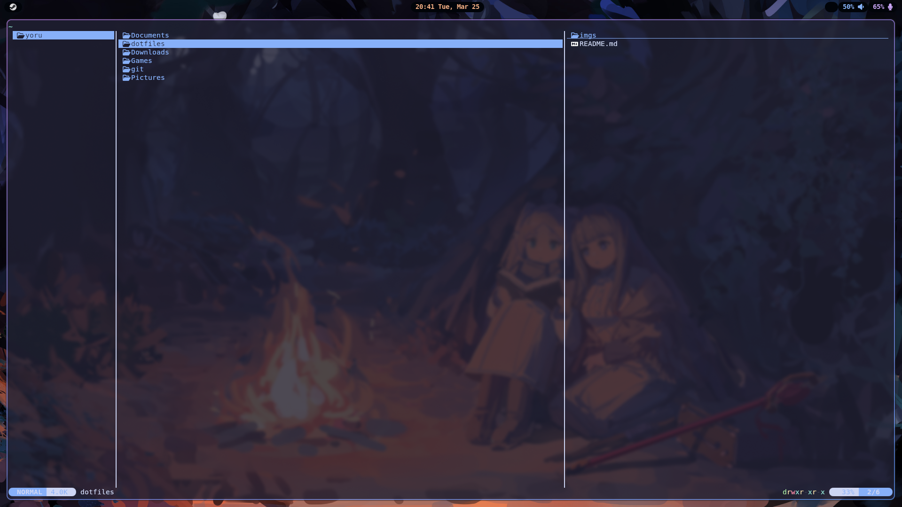
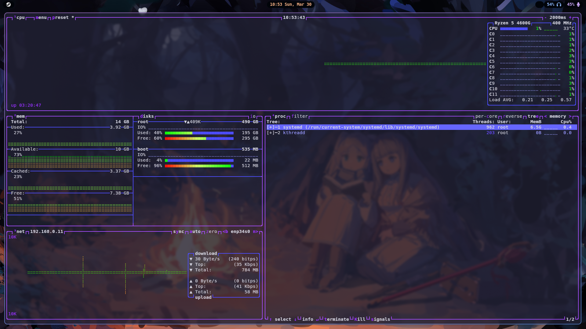

# My dotfiles repo - nixos

Repo for all my dotfiles.

# Getting started

clone this repo on home `~` and use `sudo nixos-rebuild switch --flake ~/dotfiles/.nixos/` to build the system for the first time, after the first build you can use the alias `nixos-build` instead

# Screenshots

| -                | -        | Screenshot                                         |
| ---------------- | -------- | -------------------------------------------------- |
| file manager     | yazi     |  |
| resource monitor | btop     |  |
